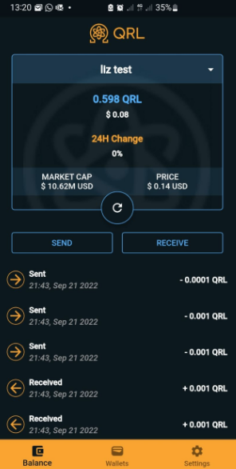

# QRL Mobile Wallet

Flutter implementation of qrl wallet for android and IOS


   


## Resources

A few resources to get you started if this is your first Flutter project:

- [Lab: Write your first Flutter app](https://docs.flutter.dev/get-started/codelab)
- [Cookbook: Useful Flutter samples](https://docs.flutter.dev/cookbook)

For help getting started with Flutter development, view the
[online documentation](https://docs.flutter.dev/), which offers tutorials,
samples, guidance on mobile development, and a full API reference.

## Getting Started

- install [dart sdk](https://dart.dev/get-dart) on system and add to path
- install [flutter sdk](https://docs.flutter.dev/get-started/install) on system
  and add to path
- execute below command in project root dir:

```
flutter build
```

## GRPC generate proto classes

- install protoc from https://github.com/protocolbuffers/protobuf/releases and
  add to
  path
- run command:

```
pub global activate protoc_plugin 
```

- add /.pub-cache/bin to your path
- execute below command to generate dart classes from proto:

```
protoc --proto_path=proto --dart_out=grpc:lib/service/proto proto/qrl.proto 
```

## Android

Install an APK on a device:

- Connect your Android device to your computer with a USB cable.
- Run command:

```
flutter install.
```

For more info on building and releasing for
android [click here](https://docs.flutter.dev/deployment/android)

## IOS

For more information on building and releasing for
IOS [click here](https://docs.flutter.dev/deployment/ios)

## Translations

After adding or changing translations run command:

```
flutter gen-l10n
```

You should see generated files in
${FLUTTER_PROJECT}/.dart_tool/flutter_gen/gen_l10n.
For more info about
translations [click here](https://docs.flutter.dev/development/accessibility-and-localization/internationalization)

## Tests

### Run tests using IntelliJ or VSCode

The Flutter plugins for IntelliJ and VSCode support running tests.
This is often the best option while writing tests because it provides the
fastest feedback loop as well as the ability to set breakpoints.

#### IntelliJ
- Open the <your-class>_test.dart file
- Select the Run menu
- Click the Run 'tests in <your-class>_test.dart' option
- Alternatively, use the appropriate keyboard shortcut for your platform.

#### VSCode
- Open the <your-class>_test.dart file
- Select the Run menu
- Click the Start Debugging option
- Alternatively, use the appropriate keyboard shortcut for your platform.

### Run tests in a terminal
You can also use a terminal to run the tests by executing the following command
from the root of the project:
```
flutter test test/<your-class>_test.dart
```
For more options regarding unit tests, you can execute this command:
```
flutter test --help
```
